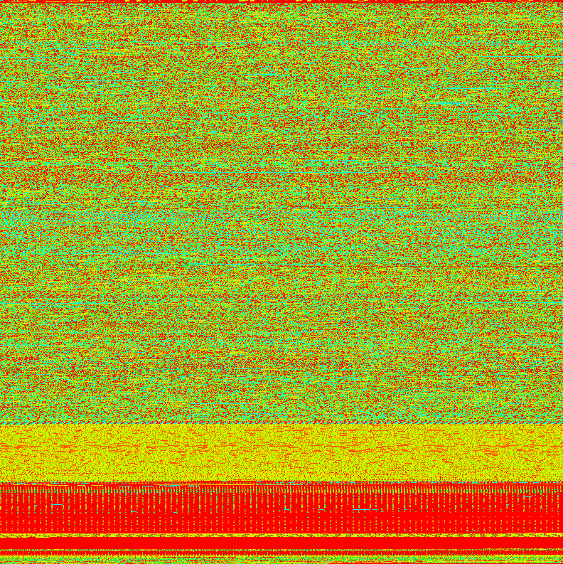

# README.md
The purpose of this tool is to create an image of binary files at the byte level, then calculate entropy.  It is helpful in depiciting how a binary is constructed and measuring its level of compression/encryption.  

## How to use the tool
Executing the tool without option will yield a brief intro how to run the tools.  Executing a `--help` will give the following more detailed instructions.
> `$byteimage.py [-c|-g] [-e] <input_file> <output_file>`  

##Example execution 
This example produces a color image and calculates entropy of the \bin\bash binary: 
Command: `$python byteimage.py -ce /bin/bash bashimage-color.png` 
Results:  
> `Generating Color Image...this may take a minute or so for large files` 
  `Calculating Entropy` 
  `Entropy Estimate: 2.11317354104`

Example Image: 

##Interpreting Results
###How to read the picture
The picture is produced by converting each byte into its integer value based on ASCII.  Every pixel represents one byte, with the color progressing from red, to green, to blue as the value increases.  The purpose of the picture is to visually display the code structure and entropy.

###How to read the entropy value
Entropy in this context means how much information is "hidden" within the file.  As file entropy goes up, the odds that it is encrypted or compressed also rises.  

- Entropy of a single number set: 0.0
- Entropy of a random number set 3.30007131282
Entropy of a no repeat number set 3.28717801941
Entropy of this README.md file: 2.2247664431
Entropy of BASH executable: 3.0486649882
Entropy of BASH executeable compressed with zip: 3.287974854
Entropy of BASH executable compressed with GZ: 3.28834155203
Entropy of Bash executable encrypted with GPG AES 2048: 3.28658408149

